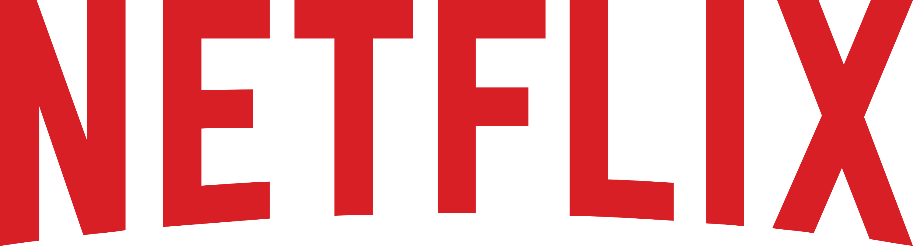
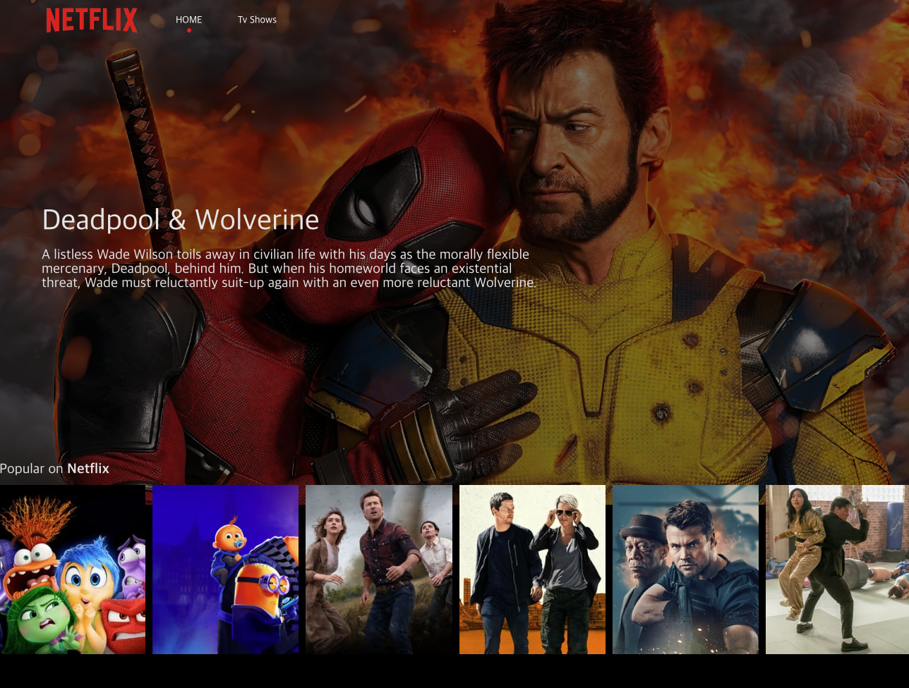

<br />
<div align="center">
  <a href="https://github.com/othneildrew/Best-README-Template">
    
  </a>

  <h3 align="center">NETFLIX CLONE</h3>

  <p align="center">
    <a  href="https://react-movie-git-main-gon2s-projects.vercel.app/">View Demo</a>
  </p>
</div>

<br/>

<!-- TABLE OF CONTENTS -->
<details>
  <summary>목차</summary>
  <ol>
    <li>
      <a href="#about-the-project">About The Project</a>
    </li>
    <li><a href="#built-with">Built With</a></li>
    <li>
      <a href="#getting-started">Getting Started</a>
    </li>
    <li><a href="#contact">Contact</a></li>
  </ol>
</details>

<br/>

<!-- ABOUT THE PROJECT -->

## About The Project



<br/>
React를 이용한 Netflix 클론 프로젝트 입니다.

<br/>
영화 리스트 / 영화 상세정보 조회 api 연동 및 리스트 slider 연동,
<br/>
영화 상세정보 카드 모달 애니메이션 등을 구현하였습니다.

<br/>
<br/>

### Built With


<br/>

<br/>

<br/>

<br/>


<br/>
<br/>

<!-- GETTING STARTED -->

## Getting Started

1. Clone the repo
   ```sh
   git clone https://github.com/gon2s/react-movie.git
   ```
2. Install YARN packages
   ```sh
   yarn install
   ```
3. Start Project
   ```sh
   yarn start
   ```

<br/>
<br/>

<!-- CONTACT -->

## Contact

NAME > 유승곤
<br/>
EMAIL > qpple6@naver.com

<p align="right">(<a href="#readme-top">back to top</a>)</p>
